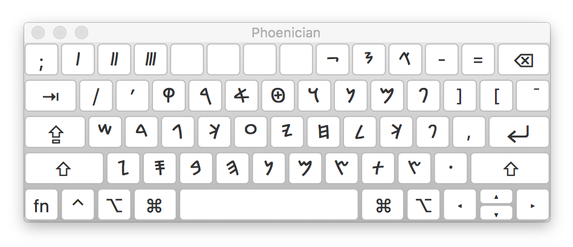

# Phoenician/Paleo-Hebrew Input Method
Unicode input method for typing in Phoenician/Paleo-Hebrew on Mac

# Key Mapping
The key mapping for the input method matches the letters of the Phoenician/Paleo-Hebrew alphabet to their corresponding Hebrew letters on the standard Hebrew keyboard layout. Where letters have different final forms in Hebrew, those letters are duplicated in this layout.

# Fonts
Google's Noto Sans Phoenician is a good place to start:
https://www.google.com/get/noto/#sans-phnx

# Mac
- Move "Phoenician.keylayout" and "Phoenician.icns" into "/Library/Keyboard Layouts"
- Open "System Preferences" -> "Keyboard" -> "Input Sources"
- Click the "+" to add a new input method and under "Others" choose "Phoenician"
